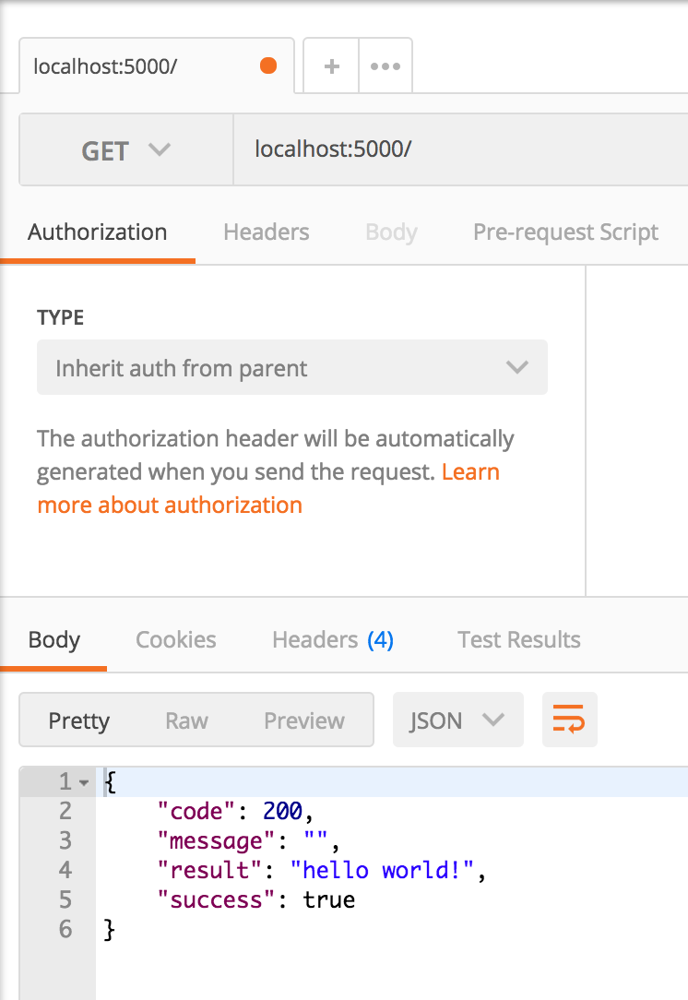
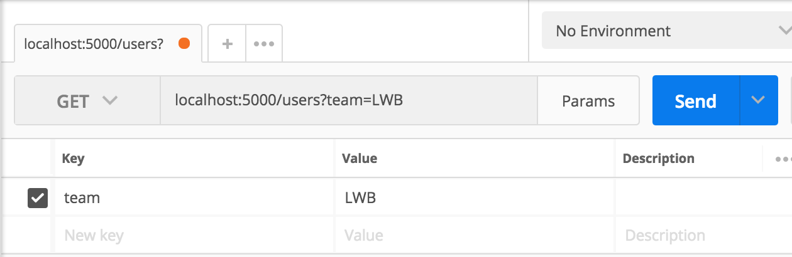
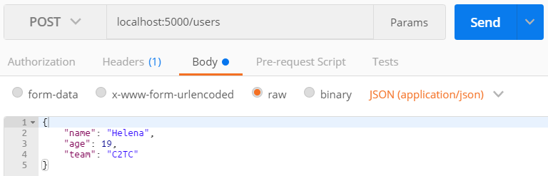

# Flask Exercise
This exercise is intended for you to get familiar with fundamental backend/server side programming in an interactive way, as well as for you to get comfortable developing in a modern Python/Flask environment.

Reading the following will help you get a sense of the big picture when it comes to developing APIs/writing server side code, and how it fits in the context of a larger web application:
* [How the Web Works](https://medium.freecodecamp.org/how-the-web-works-a-primer-for-newcomers-to-web-development-or-anyone-really-b4584e63585c) - Read all 3 parts, especially part 3!
* [Basics of HTTP](https://egghead.io/courses/understand-the-basics-of-http)

This project will be broken down into multiple parts. After you finish this project, submit a pull request and assign your tech lead to review it!

This exercise is due before the next all hands meeting (Sunday Feb 18th). However, the sooner you put up your PR, the sooner you will get a review, and the faster you will get feedback and learn!

### Guidance
We understand that a lot of you are new to Flask and backend development in general. We think going through this exercise will really help you get up to speed in order to start being productive contributing to your nonprofit project.

A lot of what makes a good software developer is being resourceful and knowing where/how to find information you need. At the same time, the entire Hack4Impact community is available if you get stuck, have unanswered questions, or want to discuss anything!

Ask questions and discuss about python as a language and its features or syntax in the `#python` Slack channel.

Ask questions and discuss about Flask, creating endpoints, or any other backend related topics in the `#backend` Slack channel.

And of course, if you are already familiar with this or have figured it out, please hop in these channels and help those who need it! :)

### Requirements
* python version 3.x
* pip
* [Postman](https://www.getpostman.com/)

Installation instructions for [Mac](https://github.com/hack4impact-uiuc/wiki/wiki/Mac-Setup) and [Windows](https://github.com/hack4impact-uiuc/wiki/wiki/Windows-Subsystem-for-Linux-Setup#setting-up-python)

Check if you have the correct versions by running the following commands in your terminal:
```
python3 -V
```
```
pip3 -V
```

### Setup
First, clone this repository and go into it:
```
$ git clone https://github.com/hack4impact-uiuc/backend-exercise.git
$ cd backend-exercise
```

Then, install `virtualenv` and run it. This allows you to have a virtual environment for your specific application.
```
$ pip3 install virtualenv
$ virtualenv -p python3 venv
$ source venv/bin/activate
```

You will then have a `(venv)` before the `$`, meaning that you are now in your virtual environment. Then, install Flask.
```
(venv)$ pip3 install Flask
(venv)$ pip3 install requests
```

You must be in this virtual environment to start this server. To start the server run:
```
(venv)$ python app.py
```

Note: This will remain a running process in your terminal, so you will need to open a new tab or window to execute other commands.

To stop the server, press `Control-C`.

To exit your virtual environment, which is named `venv`, run:
```
(venv)$ deactivate venv
```

Before you make any changes to the code, make sure to create a new branch. Typically branches are named based on the feature or bugfix being addressed, but for this project, name your branch with your own name so your reviewer can easily follow:
```
git checkout -b <YOUR_NAME>
```
Branch names should be all lowercase and can't contain spaces. Instead of spaces, use hyphens. For example:
```
git checkout -b varun-munjeti
```

### Running The Server And Calling Endpoints
Starting the server will make it a continuously running process on `localhost:5000`. In order to make requests to your server, use [Postman](https://www.getpostman.com/).

First, make a `GET` request to the `/` endpoint. Since the server is running on `localhost:5000`, the full endpoint url is `localhost:5000/`.



Try calling the `/mirror` endpoint. First, look at the code for the endpoint to see how you can specify url parameters. Then make a request on Postman to `localhost:5000/mirror/<name>`:


# Exercises
These exercises will walk you through creating a RESTful API using Flask! We don't want you to go through all the hassle of setting up a database instance, so we have created dummy data and a mock database interface to interact with it. For the sake of ease, the entire app logic minus the mockdb logic will by implemented in `app.py`. For larger projects, the API endpoints will usually be separated out into different files called `views`.

Before you start, take a good look at the `create_response` function and how it works. Make sure you follow the guidelines for how to use this function, otherwise your API will not follow the proper conventions!

Also take a look into the mock database. The initial dummy data is defined in `mockdb/dummy_data.py`. This is what will "exist" in the "database" when you start the server.

The functions defined in `mockdb/mockdb_interface.py` are how you can query the mockdb. In `app.py`, where you will be writing your API, this has been imported with the name `db`. Therefore when you write the code for your endpoints, you can call the db interface functions like `db.get('users')`.

When you modify your code, the server will automatically update, *unless* your code doesn't compile, in which case the server will stop running and you have to manually restart it after fixing your code.

## Part 1
Define the endpoint:
```
GET /users
```

This should return a properly formatted JSON response that contains a list of all the `user`s in the mockdb. If you call this endpoint immediately after starting the server, you should get this response in Postman:
```
{
  "code": 200,
  "message": "",
  "result": {
    "users": [
      {
        "age": 19,
        "id": 1,
        "name": "Aria",
        "team": "LWB"
      },
      {
        "age": 20,
        "id": 2,
        "name": "Tim",
        "team": "LWB"
      },
      {
        "age": 23,
        "id": 3,
        "name": "Varun",
        "team": "NNB"
      },
      {
        "age": 24,
        "id": 4,
        "name": "Alex",
        "team": "C2TC"
      }
    ]
  },
  "success": true
}
```

## Part 2
Define the endpoint:
```
GET /users/<id>
```

This should retrieve a single user that has the `id` provided from the request.

If there doesn't exist a user with the provided `id`, return a `404` with a descriptive `message`.

## Part 3
Extend the first `/users` enpoint by adding the ability to query the users based on the team they are on. You should *not* use a url parameter like you did in Part 2. Instead, use a [query string](https://en.wikipedia.org/wiki/Query_string).

If `team` is provided as a query string parameter, only return the users that are in that team. If there are no users on the provided `team`, return an empty list.

For this exercise, you can ignore any query string parameters other than `team`.

In Postman, you can supply query string parameters writing the query string into your request url or by hitting the `Params` button next to `Send`. Doing so will automatically fill in the request url.



## Part 4
Define the endpoint:
```
POST /users
```

This endpoint should create a new user. Each request should also send a `name`, `age`, and `team` parameter in the request's `body`. The `id` property will be created automatically in the mockdb.

A successful request should return a status code of `201` and return the newly created user.

If any of the three required parameters aren't provided, return a `422` and a useful `message`. In general, your messages should provide the user/developer useful feedback on what they did wrong and how they can fix it.

This is how you can send `body` parameters from Postman. Make sure you don't mistake this for query parameters!


## Part 5
Define the endpoint:
```
PUT /users/<id>
```

Here we need to provide a user's `id` since we need to specify which user to update. The `body` for this request should contain the same attributes as the `POST` request from Part 4.

However, the difference with this `PUT` request is that only values with the provided keys (`name`, `age`, `team`) will be updated, and any parameters not provided will not change the corresponding attribute in the user being updated.

You do not need to account for `body` parameters provided that aren't `name`, `age`, or `team`.

If the user with the provided `id` cannot be found, return a `404` and a useful `message`.

## Part 6
Define the endpoint:
```
DELETE /users/<id>
```

This will delete the user with the associated `id`. Return a useful `message`, although nothing needs to be specified in the response's `result`.

If the user with the provided `id` cannot be found, return a `404` and a useful `message`.

## Submitting
When you're done with all the steps, open a pull request (PR) and assign your tech lead to review it!

Before you can submit a PR, you'll have to push your branch to a remote branch (the one that's on GitHub, not local).

Check to see that you're on your branch:
```
git branch
```

If you want to make sure all of your commits are in:
```
git log
```
Press `Q` to quit the `git log` screen.

Push your commits to your remote branch:
```
git push
```

The first time you do this, you might get an error since your remote branch doesn't exist yet. Usually it will tell you the correct command to use:
```
git push --set-upstream origin <YOUR_BRANCH_NAME>
```
Note: this only needs to be done the first time you push a new branch. You can use just `git push` afterwards.

Follow the instructions on the [wiki](https://github.com/hack4impact-uiuc/wiki/wiki/Git-Reference-Guide#opening-a-pull-request-pr-on-github) to open the PR.

Note: make sure that you don't actually merge your PR in! We are only using it as a mechanism for providing code reviews.
